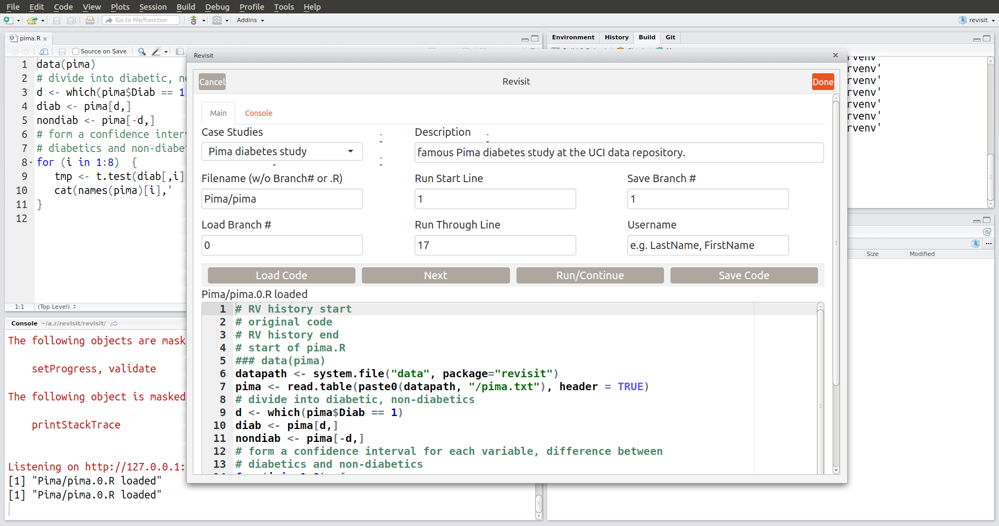
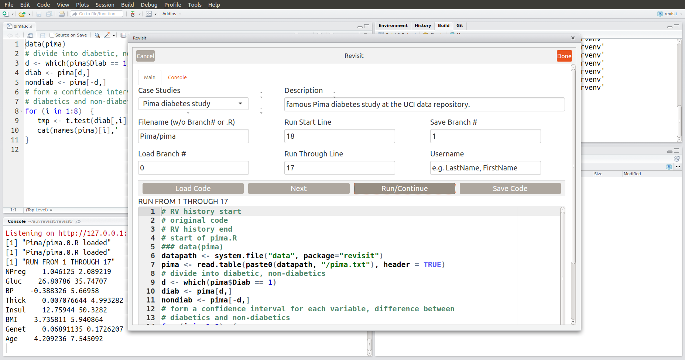
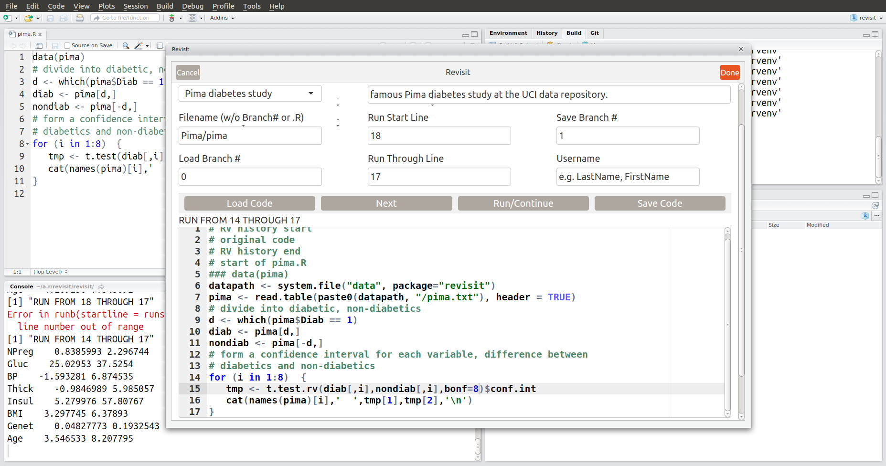
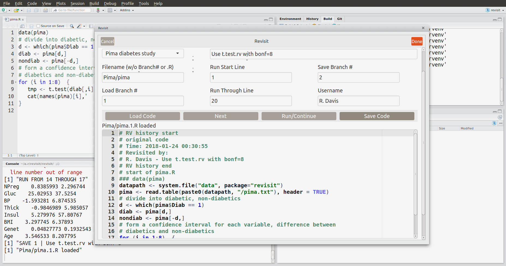
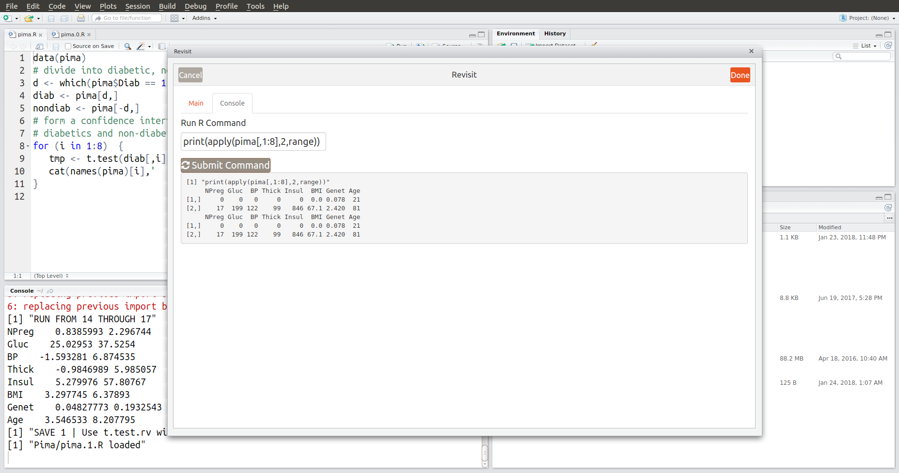
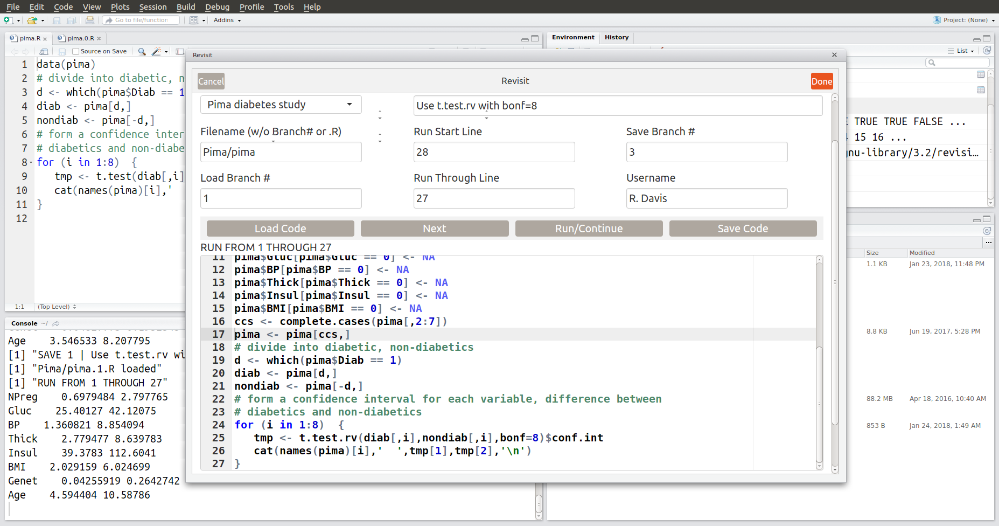
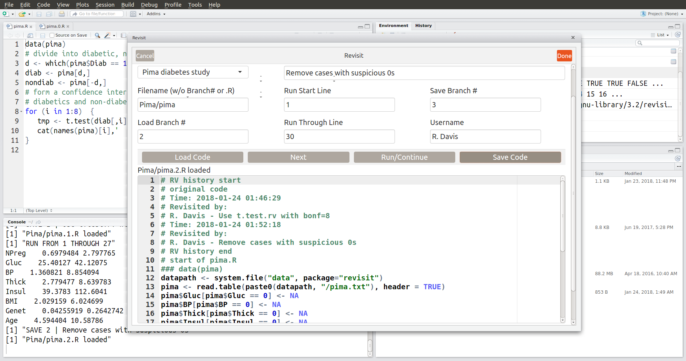

# revisit: a "Statistical Audit" for Statistical Reproducibility and Alternate Analysis

### The reproducibility crisis

In recent years, scientists, especially those who run academic journals
or fund research projects, have been greatly concerned about lack of
*reproducibility* of research.  A study performed by one research group,
with certain findings, is then attempted by another group, with
different findings.  

In addition, there is a related problem, lack of *transparency*. In
reading a paper reporting on certain research, it is often not clear
exactly what procedures the authors used.

[As reported for
instance](http://www.nature.com/news/1-500-scientists-lift-the-lid-on-reproducibility-1.19970)
in the journal *Nature*, the problem is considered by many to have
reached crisis stage.
**Much of the concern is statistical**. As noted in the 
*Nature* report (emphasis added):

> The survey asked scientists what led to problems in reproducibility.
> More than 60% of respondents said that each of two factors — pressure to
> publish and **selective reporting** — always or often contributed. More than
> half pointed to insufficient replication in the lab, poor oversight or
> *l*ow statistical power*.*
> 
> Respondents were asked to rate 11 different approaches to improving
> reproducibility in science, and all got ringing endorsements. Nearly 90%
> — more than 1,000 people — ticked "**More robust experimental design"
> "better statistics"...**

The package is, made available as open source, has two aims:

* Helping to remedy such problems with data handling and statistics.

* Use as a teaching tool, with many case studies showing alternative
  statistical analyses.

### The **revisit** package 

In one sense, the package might be said to enable a *statistical audit*,
allowing users to check the statistical analyses of the original authors
of a study, but it really is much more.  In our referring to "users"
below, keep in mind that this could mean various kinds of people, such
as:

* **The various authors of the study,** during the period when the study is
  being conducted.  The package will facilitate collaboration among the
  authors at that time.

* **Reviewers of a manuscript on the study**, presented for possible
  publication.  The package will facilitate the reviewers' checking of
  the statistical analyses in the paper, not only verifying the steps
  but, even more importantly, allowing the reviewer to explore
  alternative analyses.

* **Other scientists,** who are reading a published paper on the study.  The
  package will facilitate these scientists also in exploring various
  alternative analyses.

The package has two main aspects:

**(a)**

It makes it easier and more convenient for the user to explore the
effects of various changes that might be made to the analyses.
The package facilitates 

* replaying,

* changing, and

* recording

various new versions of the analyses. 

**(b)**

The package spots troublesome statistical situations, and issues
advice and warnings, in light of concerns that too many "false
positives" are being reported in published research.  For example, the
package may:

* Point out that a p-value is small and may not to correspond to an
  effect of practical importance.

* Point out that a "nonsignificant" value corresponds to a
  confidence interval containing both large positive and large
  negative values, so n is too small for a "no significant
  difference" finding.

* Suggest that the user employ a multiple inference procedure
  (provided in the package).

* Detect the presence of highly influential outliers, and suggest
  that a robust method, e.g. quantile regression be used.

* Detect evidence of possible overfitting.

* Etc.

(Only some of these are implemented so far.)

More specifically, the user might go through the following thought
processes, and take action using the facilities in the package:

*  The user thinks of questions involving alternate scenarios.  What,
   for instance, would occur if one were to more aggressively weed out
   outliers, or use outlier-resistant methods?  How would the results 
   change?  What if different predictor variables were used, or 
   squared and interaction terms added?  How valid are the models and 
   assumptions?  What about entirely different statistical approaches?

*  In exploring such questions, the user will modify the original
   code, producing at least one new version of the code, and
   likely several versions.  Say for instance the user is considering
   making two changes to the original analysis, one to possibly
   use outlier-resistant methods and another to use multiple-inference
   procedures. That potentially sets up four different versions.
   The **revisit** package facilitates this, making easier for the 
   user to make changes, try them out and record them into different 
   *branches* of the code.  In other words, the package facilitates
   exploration of alternative analyses.

*  In addition, the user may wish to share the results of her exploration 
   of alternate analyses of the data with others.  Since 
   each of her branches is conveniently packaged into a separate file, 
   she then simply sends the files to the other researchers.  The
   package allows the latter to easily "replay" the analyses, and they
   in turn may use the package to produce further branches.

* *Note, though, that the package is not aimed to "automate" statistical
analysis.*  The user decides which analyses to try, with the 
package consisting of tools to help by making it easy to explore, record and
package alternative analyses.

If the original data file is, say, **x.R**, then the branches will be
given names by the users, say **x.1.R**, **x.2.R** and so on.  Each
branch will have a brief, user-supplied description.


### Language and interface

The software is written in R, and is currently *in prototype form*. The
author of the original research is assumed to do all data/statistical
analysis in R.

Both text-based and graphical (GUI) interfaces are available.
The GUI uses RStudio *add-ins*.  The text-based version provides more
flexiblity, while the GUI provides convenience.

### First example

Let's get started, using the GUI.  (See installation instructions
below.)

We start up RStudio (either by icon or by typing 'RStudio' (or possibly
'rstudio') with the proper search path into a terminal window), then
(near the top of the screen) selecting **Addins | Revisit**.

This example uses the famous Pima diabetes study at the UCI data repository.
The following table shows the 9 variables in **pima.txt**, followed by their
descriptions from [this link](https://archive.ics.uci.edu/ml/datasets/pima+indians+diabetes):

| Variable | Description                                                              |
| -------- | ------------------------------------------------------------------------ |
| NPreg    | Number of times pregnant                                                 |
| Gluc     | Plasma glucose concentration a 2 hours in an oral glucose tolerance test |
| BP       | Diastolic blood pressure (mm Hg)                                         |
| Thick    | Triceps skin fold thickness (mm)                                         |
| Insul    | 2-Hour serum insulin (mu U/ml)                                           |
| BMI      | Body mass index (weight in kg/(height in m)^2)                           |
| Genet    | Diabetes pedigree function                                               |
| Age      | Age (years)                                                              |
| Diab     | Class variable (0 or 1)                                                  |

As an illustration, we have code <strong>pima.R</strong> included in the
package, which will be in the file **revisit/CaseStudies/Pima/pima.R**
within our directory of installed R packages, which was **~/R** in the
example run here.  In the GUI version, we simply type the file
name/location into the **Filename** box, with full path, e.g.
**~/R/revisit/CaseStudies/Pima/pima/pima**, then click **Load Code**.

The screen now looks like this:



RStudio is running in the background window, and the foreground window
shows the **revisit** add-in.  The original author's code is shown in
the editor portion in the bottom half of that window.  One can edit the
code, re-run in full or in part (**Run/Continue** and **Next** buttons),
save/load branches (**Save Code** and **Load Code** buttons) and so on.  All
output will be displayed in the R console portion of the background
window.

By the way, if **Load Branch #** is 0 and the branch 0 file cannot be found,
**revisit** will attempt to load the original author code.  If that file is
found, **revisit** will automatically create the branch 0 file, identical
to the original author code, but with an identifying comment line.

To replay the author's code without modfication, we click **Run/Continue**.
The new screen is:



The results of the 8 confidence interval computations are shown in the R
console.  (There are 8 variables other than Diab, so the intervals
concern differences between diabetics and nondiabetics.)

We as the user may now think, "Hmm, one really should use a multiple
inference procedure here."  So we change line 12 to use **revisit**'s own
function, employing the Bonferroni method with number of comparisons
equal to 8.

We then re-run.  If we fail to reset the **Run Start Line** and **Run
Through Line** first, however, we will get the error shown in red in the
console below.  This is because **revisit** had already run through the
end of the code.  *There is no need to start from the beginning*, so we
change the **Run Start Line** box to 11, reset the **Run Through Line**
box to the last line (if necessary) and click **Run/Continue**, yielding:



Ah, the confidence intervals did indeed get wider, as expected, in
line with statistical fairness.  (Note that the **Run Start** Line box has
again moved one past the last line of code.)

Say we believe this branch is worth saving.  The **Save Branch #** box tells
us the next branch will be named branch 1 (we could change that).  Before
saving, we are required to type in a description of the change.  If we now
click **Save Code**, the new branch will be reloaded with the description now
visible in the last line of the revisit history at the top of the file
as shown below:



By the way, look at the comments at the top of the code,

``` r
# RV history start
original code
Use t.test.rv with bonf = 8
# RV history end
```

Each time we save a new branch, the description comments of the source
branch are accumulated, thus providing a change hsitory.

We should also check whether the author did a good job of data cleaning.
As a crude measure, we can find the range of each of the variables, say
by running the code

``` r
print(apply(pima[,1:8],2,range))
```

We could simply run this code directly if we were in the text-based
version of **revisit**, since there we would have direct control of the
R console. This is not the case in the GUI version. So instead, we add
the code temporarily at the end of code editor, as line 16. We change
the **Run Start Line** box to 16, and hit **Run/Continue**:



Those 0s are troubling. How can variables such as Glucose and BMI be 0?
The descriptions of the variables above suggest that the 0s for the
variables Gluc, BP, Thick, Insul, and BMI actually represent missing
values.  Those 0s can be set to missing with the first five of the
following statements:

``` r
pima$Gluc[pima$Gluc == 0] <- NA
pima$BP[pima$BP == 0] <- NA
pima$Thick[pima$Thick == 0] <- NA
pima$Insul[pima$Insul == 0] <- NA
pima$BMI[pima$BMI == 0] <- NA
ccs <- complete.cases(pima[,2:7])
pima <- pima[ccs,]
```

The last two statements will drop all cases that contain one or more
suspicious 0s.  Suppose we add all seven statements to the code
immediately after pima is loaded, reset **Run Start Line** and **Run Through
Line** to run all of the code, and click **Run/Continue**.  Following is the
result:



As can be seen from the output of the ranges, NPreg is now the only
variable that contains 0s, the one variable for which they make sense.
We can also see that the confidence intervals have changed.  They
should be more accurate now that cases that contain 0s which are
actually missing values have been removed.  We can then delete the
last line which prints the ranges (**print(apply(pima[,1:8],2,range))**)
as this was intended just for temporary use.

Say we then believe this branch is worth saving.  The **Save Branch #**
box tells us the next branch will be named branch 2 (as before, we
could change that).  Before saving, we are again required to type
in a description of the change.  If we do that and then click **Save
Code**, the new branch will be reloaded with the description now
visible in the last line of the revisit history at the top of the
file as shown below:



### Main text-based functions

Here are the functions available in the text-based prototype. Many more
coming!

**rvinit():**  Initializes the **revisit** system.

**makebranch0(origcodenm):**  Inputs the original author's code and
forms a branch copy of it.

**loadb(br):**  Loads a branch.

**runb(startline,throughline):**  Runs a branch through a user-specified
set of lines in the code, pausing at the end.  By default, these are the
numbers of the first and last lines of the code, but other numbers can
be specified.  Use 'c' to continue from the current line, or 's' to
execute just the current line.  (*Restriction:* The start and finish
lines cannot be inside a loops or if-then-else constructs.)  

**saveb(branchnum,desc):**  Save all the code changes to a new branch
with the given name and brief description.

**pause():**  Insert this call to pause execution at the given
point, useful for instance immediately following a plotting function to
give the user a chance to view the plot.

**t.test.rv(x,y,alpha,bonf):**  Substitute for R's **t.test()**.  Calls the
latter but warns the user if a small p-value arises merely from a large
sample size rather than from a substantial effect.  If **bonf** is
larger than 1, **alpha** will be divided by **bonf** to implement
Bonferroni Inequality-based multiple inference.  (Holm option coming
soon.)

**coef.rv(lmobj,alpha=0.05,usebonf=TRUE):**  Substitute for R's
**coef()**, which extracts estimated coefficients from the output of
**lm()** and **glm()**.  If **usebonf** is true, then Bonferroni
adjustments will be made to the p-values in testing H<sub>0</sub>:
&beta;<sub>i</sub> = 0, with the Bonferroni factor equal to the number
of coefficients.  Again, statistically significant effects that may not
be of practical significance will be flagged.

**edt():**  Make a change to the current code.  Calls R's **edit()**,
thus invoking a text editor of the user's choice (or default).

**lcc():**  Display the current code.

### Second example

Here we look at the MovieLens data. The owners of this data forbid
redistribution, so it is not included here, but it can be downloaded
from the [MovieLens data site](https://grouplens.org/datasets/
movielens/100k/).  This version of the data consists of 100,000 movie
ratings.  There are about 1000 users and 1700 films.  There is some
covariate information, including age and gender for the users, as well
as for the movies, e.g. year of release and genre.  Suppose someone had
done a study of this data, focusing on the effects of age and gender.  

We'll use the text version of **revisit** here, both to make our
presentation less cluttered and to illustrate an advantage to using this
version.  

Suppose the author of a study of this data had analyzed with the code
**CaseStudies/MovieLens/movielens.R** in this package.  We'll assume
that that file is in our current directory, which we can conveniently
arrange by running {\bf getexample}.
```
 
So, let's load the code and take a look:

``` r
> library(revisit)
> rvinit()
> getexample('MovieLens/movielens.R')
> loadb('movielens.R')
> lcc()  # list the code
[1] "next line to execute indicated by ***"
1 *** # RV history start 
2 # original code 
3 # RV history end 
4  
5 # analysis of MovieLens data,  
6 # https://grouplens.org/datasets/movielens/100k/ 
7  
8 # read ratings data (userID, movieID, rating, timestamp) 
9 ud <- read.table('u.data',header=F,sep='\t') 
10 # read user covariate data (user, age, gender, ...( 
11 uu <- read.table('u.user',header=F,sep='|') 
12  
13 ud <- ud[,-4]   # remove timestamp, leaving user, item, rating 
14 uu <- uu[,1:3]   
15 names(ud) <- c('user','item','rating') 
16 names(uu) <- c('user','age','gender') 
17 uu$gender <- as.integer(uu$gender == 'M') 
18 uall <- merge(ud,uu) 
19  
20 # investigate effect of age, gender on user mean ratings 
21 usermeans <- tapply(uall$rating,uall$user,mean) 
22 lmout <- lm(usermeans ~ uu[,2] + uu[,3]) 
23 print(summary(lmout))  # get estimates, p-values etc. 
```

And now run it:

``` r
> runb()

Call:
lm(formula = usermeans ~ uu[, 2] + uu[, 3])

Residuals:
     Min       1Q   Median       3Q      Max 
-2.06903 -0.25972  0.03078  0.27967  1.34615 

Coefficients:
             Estimate Std. Error t value Pr(>|t|)    
(Intercept) 3.4725821  0.0482655  71.947  < 2e-16 ***
uu[, 2]     0.0033891  0.0011860   2.858  0.00436 ** 
uu[, 3]     0.0002862  0.0318670   0.009  0.99284    
---
Signif. codes:  0 ‘***’ 0.001 ‘**’ 0.01 ‘*’ 0.05 ‘.’ 0.1 ‘ ’ 1

Residual standard error: 0.4438 on 940 degrees of freedom
Multiple R-squared:  0.008615,  Adjusted R-squared:  0.006505 
F-statistic: 4.084 on 2 and 940 DF,  p-value: 0.01714
```

This indicates a highly-significant and positive effect of age on
ratings.  But let's look closer, by running the **revisit** function
**coef.rv()**.  We could do this by calling **edt()**, 
adding a call to **coef.rv()** to the code, and then calling
**runb()** again. But it is more convenient to simply run that command
directly, since (unlike the GUI case) we do have control of the R
console:

``` r
> coef.rv(lmout)
          est.         left       right      p-val warning
1 3.4725821093  3.357035467 3.588128752 0.00000000        
2 0.0033891042  0.000549889 0.006228319 0.01280424       X
3 0.0002862087 -0.076002838 0.076575255 1.00000000        
```

The resulting p-value indicates a "significant" result, but there is an
X in the warning column.  The estimated age coefficient here, about
0.0034 is tiny; a 10-year difference in age corresponds to a difference
in mean rating of only abou 0.034, minuscule for ratings in the range of
1 to 5.  This "significant" result is likely of no practical interest.

### Third example

Here we analyze the data set **ols262**.  (Data and code courtesy of M.
Zavodny, Stata translated to R by R. Davis. There are some differences
in the analysis here, e.g. the author used clustered standard errors.)

The data involve a study of the impact of H-1B, [a controversial work visa
program](http://www.cbsnews.com/news/are-u-s-jobs-vulnerable-to-workers-with-h-1b-visas/).
The author [found](http://www.aei.org/wp-content/uploads/2011/12/-immigration-and-american-jobs_144002688962.pdf)
that for every 100 visa workers, about 262 new jobs are
created.  This kind of finding 
[has been
debated](https://gspp.berkeley.edu/assets/uploads/research/pdf/w20668.pdf)
but our concern here will not be on the economic issues, rather on how
**revisit** might be used on this analysis.

The data consist of employment figures for each of the 50 states, in
each of the years 2000-2010.

Again, we'll use the text version of **revisit**.  Assume that we've
copied **CaseStudies/Zavodny/ols262.R** to the current directory, from which we
will load it.

``` r
> library(revisit)
> rvinit()  # required initialization
> loadb('ols262.R')  # load the branch
> lcc()  # list the code
1 # the file public.dta and the Stata code on which this R code is based 
2 # is courtesy of M. Zavodny 
3  
4 data(zav) # zav.txt is .txt version of Zav. file public.dta 
5 zav = zav[zav$year < 2008,] # 2000-2007 (first year in zav.txt is 2000) 
6  
7 ##### traditional employment rate and immigrant share model ##### 
8  
9 # employment rate for natives = employed natives divided by total native 
10 # population 
11 zav$emprate_native   <- zav$emp_native / zav$pop_native * 100 
...
...
...
68 print(paste("Jobs    =", jobs)) 
```

So, let's run the author's original code:

``` r
> runb()
[1] "Slope   = 0.00446438147988468"
[1] "P-value = 0.0140870195483076"
[1] "Jobs    = 262.985782017836"
```

In this code, the author removed the years 2008-2010. (She later ran a
full analysis.)  We might wonder how things would change if the full
data were used.  So, we call **edt()** (not shown) to remove or comment
out line 5, and re-run:

``` r
> runb()
[1] "Slope   = 0.00180848722715659"
[1] "P-value = 0.33637275201986"
[1] "Jobs    = 124.352299406043"
```

Now, the result is no longer significant, and the point estimate has
been cut in half.

We might wonder what the adjusted R-squared value was.  We can determine
this by calling R's **summary()** function:

``` r
> summary(mm)
...
Coefficients:
                             Estimate Std. Error t value
(Intercept)                 4.1640851  0.0121807 341.859
lnimmshare_emp_stem_e_grad  0.0018085  0.0018784   0.963
lnimmshare_emp_stem_n_grad  0.0006618  0.0020183   0.328
fyear2001                  -0.0108863  0.0039629  -2.747
fyear2002                  -0.0323695  0.0040825  -7.929
fyear2003                  -0.0469532  0.0040340 -11.639
fyear2004                  -0.0502315  0.0039222 -12.807
fyear2005                  -0.0437600  0.0040080 -10.918
fyear2006                  -0.0408921  0.0039598 -10.327
fyear2007                  -0.0420868  0.0039926 -10.541
fyear2008                  -0.0526175  0.0039486 -13.325
fyear2009                  -0.0985554  0.0039663 -24.848
fyear2010                  -0.1140401  0.0039186 -29.102
fstate2                     0.0192225  0.0211427   0.909
fstate4                     0.0253171  0.0106471   2.378
...
Residual standard error: 0.002534 on 324 degrees of freedom
Multiple R-squared:  0.9226,	Adjusted R-squared:  0.9082 
F-statistic: 64.35 on 60 and 324 DF,  p-value: < 2.2e-16
```

This is a high value.  However, what are the main drivers here?  We
might guess that the effects of the individual states are substantial,
so we try re-running the regression without them:

``` r
> summary((with(kk,
+    lm(lnemprate_native ~  
+       lnimmshare_emp_stem_e_grad +  
+       lnimmshare_emp_stem_n_grad +  
+       fyear,
+       weights=weight_native))))

...

Coefficients:
                             Estimate Std. Error t value
(Intercept)                 4.1780416  0.0106922 390.756
lnimmshare_emp_stem_e_grad -0.0130295  0.0036493  -3.570
lnimmshare_emp_stem_n_grad  0.0005722  0.0040274   0.142
fyear2001                  -0.0098670  0.0104854  -0.941
...
Residual standard error: 0.006736 on 372 degrees of freedom
Multiple R-squared:  0.372,	Adjusted R-squared:  0.3517 
F-statistic: 18.36 on 12 and 372 DF,  p-value: < 2.2e-16
```

Now adjusted R-squared is only 0.3517, quite a drop. So, state-to-state
variation was the main driver of the high R-squared value, rather than
the H-1B share, the latter now being dubious anyway.

The reader is free to try other time windows and so on, exactly the
point of the package.

### Fourth example

Here we look at the most cited result from the 2010 paper by economists
Carmen Reinhart and Kenneth Rogoff (hereafter called RR) titled ["Growth
in a Time of Debt"](http://www.nber.org/papers/w15639.pdf).  That result
is shown in Appendix Table 1 and is the -0.1 percent average real GDP growth
found from 1946 to 2009 for advanced economies with central government
debt of 90 percent and above.

According to [this blog
post](https://www.washingtonpost.com/news/wonk/wp/2013/04/16/is-the-best-evidence-for-austerity-based-on-an-excel-spreadsheet-error/),
"that 90 percent figure has often been cited in the past few years as
one big reason why countries must trim their deficits - even if their
economies are still weak."  However, the blog post then describes an
[April 2013 critique by Thomas Herndon, Michael Ash and Robert
Pollin](http://www.peri.umass.edu/fileadmin/pdf/working_papers/working_papers_301-350/WP322.pdf)
(hereafter called HAP) which claims that this result needs revision.
The critique points to four errors or questionable methodologies, the
most reported of which was an Excel spreadsheet error.

In order to understand the problems, it's useful to look at the actual data.  Page 6 of the critique states that RR reports 96 points of data in the above 90 debt/GDP category but that there were 110 data points before RR excluded 14 of them.  The following table shows those 110 data points:

```
        Aus-                                                     New 
Year tralia* Belgium* Canada* Greece Ireland   Italy   Japan Zealand      UK      US
---- ------- ------- ------- ------- ------- ------- ------- ------- ------- -------
1946    -3.6^      .    -1.0^      .       .       .       .     7.7^   -2.5   -10.9
1947     2.5^   15.2     4.4^      .       .       .       .    11.9^   -1.3    -0.9
1948     6.4^      .     1.8^      .       .       .       .    -9.9^    2.9     4.4
1949     6.6^      .     2.2^      .       .       .       .    10.8^    3.3    -0.5
1950     6.9^      .     7.4^      .       .       .       .       .     3.2       .
1951       .       .       .       .       .       .       .    -7.6     2.7       .
1952       .       .       .       .       .       .       .       .     0.1       .
1953       .       .       .       .       .       .       .       .     3.8       .
1954       .       .       .       .       .       .       .       .     4.1       .
1955       .       .       .       .       .       .       .       .     3.5       .
1956       .       .       .       .       .       .       .       .     0.9       .
1957       .       .       .       .       .       .       .       .     1.7       .
1958       .       .       .       .       .       .       .       .     0.3       .
1959       .       .       .       .       .       .       .       .     4.3       .
1960       .       .       .       .       .       .       .       .     5.3       .
1961       .       .       .       .       .       .       .       .     2.3       .
1962       .       .       .       .       .       .       .       .     1.1       .
1963       .       .       .       .       .       .       .       .     4.3       .
1964       .       .       .       .       .       .       .       .     5.5       .

-------------------------(no cases from 1965 to 1982)-------------------------------

1983       .       .       .       .    -0.7       .       .       .       .       .
1984       .     2.1       .       .     3.2       .       .       .       .       .
1985       .     1.8       .       .     1.9       .       .       .       .       .
1986       .     1.9       .       .     0.4       .       .       .       .       .
1987       .     2.4       .       .     3.6       .       .       .       .       .
1988       .     4.6       .       .     3.0       .       .       .       .       .
1989       .     3.6       .       .     5.6       .       .       .       .       .
1990       .     3.1       .       .       .       .       .       .       .       .
1991       .     1.8       .     3.1       .       .       .       .       .       .
1992       .     1.3       .     0.7       .       .       .       .       .       .
1993       .    -0.7       .    -1.6       .    -0.9       .       .       .       .
1994       .     3.3       .     2.0       .     2.2       .       .       .       .
1995       .     4.3       .     2.1       .     2.8       .       .       .       .
1996       .     0.9       .     2.4       .     1.1       .       .       .       .
1997       .     3.7       .     3.6       .     1.9       .       .       .       .
1998       .     1.7       .     3.4       .     1.4       .       .       .       .
1999       .     3.4       .     3.4       .     1.5    -0.1       .       .       .
2000       .     3.8       .     4.5       .     3.7     2.9       .       .       .
2001       .     0.8       .     4.2       .     1.8     0.2       .       .       .
2002       .     1.5       .     3.4       .       .     0.3       .       .       .
2003       .     1.0       .     5.6       .       .     1.4       .       .       .
2004       .     2.8       .     4.9       .       .     2.7       .       .       .
2005       .     2.2       .     2.9       .       .     1.9       .       .       .
2006       .       .       .     4.5       .       .     2.0       .       .       .
2007       .       .       .     4.0       .       .     2.3       .       .       .
2008       .     1.0       .     2.9       .       .    -0.7       .       .       .
2009       .    -3.2       .    -0.8       .    -5.1    -5.4       .       .       .

* column excluded by RR because of Excel error
^ data purposely excluded by RR
```

As can be seen, the 14 points excluded by RR are 1946-1950 for Australia
and Canada and 1946-1949 for New Zealand.  This exclusion is one of the
problems listed by HAP.  Also visible is that Australia, Belgium, and
Canada are excluded due to the Excel spreadsheet error.  However,
Australia and Canada had already been excluded deliberately, so only the
Belgium exclusion matters.  In any case, this is a second problem.  A
third problem is an apparent transcription error which is described in
footnote 6 on page 9 the [HAL
critique](http://www.peri.umass.edu/fileadmin/pdf/working_papers/working_papers_301-350/WP322.pdf)
as follows:

> An apparent transcription error in transferring the country average from the country-specific sheets to
> the summary sheet reduced New Zealand’s average growth in the highest public debt category from −7.6
> to −7.9 percent per year. With only seven countries appearing in the highest public debt/GDP group, this
> transcription error reduces the estimate of average real GDP growth by another −0.1 percentage point.
 
The fourth problem is that RR weights the averages by countries.  Hence, the -7.6 percent average for New Zealand has the same weight as the 2.4 percent average for the UK even though the former derives from a single year and the latter derives from 19 consecutive years.  The HAL critique concedes that the correct weighting might not necessarily be 1 to 19 in this case, stating "within-country serially correlated relationships could support an argument that not every additional country-year contributes proportionally additional information."  Yet equal weighting would definitely not seem correct as 19 years could not reasonably represent a single "episode".

Results from fixing various combinations of these four problems are shown in Table 3 of the [HAL critique](http://www.peri.umass.edu/fileadmin/pdf/working_papers/working_papers_301-350/WP322.pdf).  The following shows how to load and list the R program **RR90all.R** which attempts to reproduce many of these results:

```r
> library(revisit)
> rvinit()
> getexample('CaseStudies/RR/RR90all.R')
> loadb('RR90all.R')
> lcc()
[1] "next line to execute indicated by ***"
1 *** library(foreign) 
2 library(plyr) 
3  
4 prtWeightByCountry <- function(df, label){ 
5   Country <- c("Australia","Belgium","Canada","Greece","Ireland","Italy","Japan","New Zealand","UK","US") 
6   country <- data.frame(Country) 
7   cc <- ddply(df, .(Country), summarize, dRGDP=mean(dRGDP)) 
8   tot <- mean(cc$dRGDP) 
9   cc <- merge(country, cc, all.x = TRUE) 
10   cat(sprintf("%6.1f %7.1f %6.1f %6.1f %7.1f %6.1f %6.1f %7.1f %6.1f %6.1f %6.2f  %s\n", 
11               cc$dRGDP[1], cc$dRGDP[2], cc$dRGDP[3], cc$dRGDP[4], cc$dRGDP[5], 
12               cc$dRGDP[6], cc$dRGDP[7], cc$dRGDP[8], cc$dRGDP[9], cc$dRGDP[10], tot, label)) 
13 } 
14  
15 prtWeightByCountryYr <- function(df, label){ 
16   cc <- ddply(df, .(Country), summarize, dRGDP=mean(dRGDP)) 
17   cat(sprintf("%6.1f %7.1f %6.1f %6.1f %7.1f %6.1f %6.1f %7.1f %6.1f %6.1f %6.2f  %s\n", 
18               cc$dRGDP[1], cc$dRGDP[2], cc$dRGDP[3], cc$dRGDP[4], cc$dRGDP[5], 
19               cc$dRGDP[6], cc$dRGDP[7], cc$dRGDP[8], cc$dRGDP[9], cc$dRGDP[10], mean(df$dRGDP), label)) 
20 } 
21  
22 # The data file "RR-processed.dta" comes from the Herndon, Ash and Pollin (HAP) zip file 
23 # https://www.peri.umass.edu/images/WP322HAP-RR-GITD-code-2013-05-17.zip 
24 # which is linked to at 
25 # https://www.peri.umass.edu/publication/item/526-does-high-public-debt-consistently-stifle-economic-growth-a-critique-of-reinhart-and-rogo-ff . 
26 # RR-processed.dta is created by the HAP program RR.R, also in the zip file. 
27  
28 RRp <- read.dta("RR-processed.dta") 
29 print("number of data in RR-processed.dta") 
30 print(dim(RRp)[1]) 
31 RR90 <- RRp[!is.na(RRp$dRGDP) & !is.na(RRp$debtgdp) & RRp$debtgdp > 90,] 
32 print("number of data with debtgdp > 90") 
33 print(dim(RR90)[1]) 
34 RR1 <- RR90[RR90$Country != "Belgium" & 
35             RR90$Country != "Australia" & 
36             RR90$Country != "Canada" & 
37             (RR90$Country != "New Zealand" | RR90$Year > 1949),] 
38 RR0 <- RR1 
39 RR0$dRGDP[RR0$Country == "New Zealand" & RR0$Year == 1951] <- -7.9 # transcription  error 
40 print("number of data used by RR") 
41 print(dim(RR1)[1]) 
42  
43 hdr1 <- c("  Aus-","       ","      ","      ","       ", 
44           "      ","      ","    New","\n") 
45 hdr2 <- c("tralia","Belgium","Canada","Greece","Ireland", 
46           " Italy"," Japan","Zealand","    UK","    US", " TOTAL  Scenario\n") 
47 cat(hdr1) 
48 cat(hdr2) 
49 prtWeightByCountry(RR0, "RR (Reinhart and Rogoff)") 
50 prtWeightByCountry(RR1, "+ fix NZ transcription") 
51  
52 RR2 <- RR90[RR90$Country != "Australia" & 
53             RR90$Country != "Canada" & 
54             (RR90$Country != "New Zealand" | RR90$Year > 1949),] 
55 prtWeightByCountry(RR2, "+ fix Excel error") 
56  
57 RR3 <- RR90[RR90$Country != "Australia" & 
58             RR90$Country != "Canada",] 
59 prtWeightByCountry(RR3, "+ include 1946-1949 for NZ") 
60  
61 prtWeightByCountry(RR90, "+ include all data (1946-09)") 
62 prtWeightByCountryYr(RR90, "+ use country-year weighting") 
63  
64 RR4 <- RR90[RR90$Year >= 1947,] 
65 prtWeightByCountry(RR4, "all data for 1947-2009") 
66  
67 RR5 <- RR90[RR90$Year >= 1952,] 
68 prtWeightByCountry(RR5, "all data for 1952-2009") 
69  
70 RR6 <- RR90[RR90$Year >= 1980,] 
71 prtWeightByCountry(RR6, "all data for 1980-2009") 
```
As stated in lines 22 to 26, this program reads the file RR-processed.dta which comes from the a [Herndon, Ash and Pollin (HAP) zip file](https://www.peri.umass.edu/images/WP322HAP-RR-GITD-code-2013-05-17.zip) which is linked to [here](https://www.peri.umass.edu/publication/item/526-does-high-public-debt-consistently-stifle-economic-growth-a-critique-of-reinhart-and-rogo-ff).  The following shows the results of running RR90all.R:

```
> runb()
[1] "number of data in RR-processed.dta"
[1] 1275
[1] "number of data with debtgdp > 90"
[1] 110
[1] "number of data used by RR"
[1] 71
  Aus-                                                 New 
tralia Belgium Canada Greece Ireland  Italy  Japan Zealand     UK     US  TOTAL  Scenario
    NA      NA     NA    2.9     2.4    1.0    0.7    -7.9    2.4   -2.0  -0.06  RR (Reinhart and Rogoff)
    NA      NA     NA    2.9     2.4    1.0    0.7    -7.6    2.4   -2.0  -0.02  + fix NZ transcription
    NA     2.6     NA    2.9     2.4    1.0    0.7    -7.6    2.4   -2.0   0.30  + fix Excel error
    NA     2.6     NA    2.9     2.4    1.0    0.7     2.6    2.4   -2.0   1.58  + include 1946-1949 for NZ
   3.8     2.6    3.0    2.9     2.4    1.0    0.7     2.6    2.4   -2.0   1.93  + include all data (1946-09)
   3.8     2.6    3.0    2.9     2.4    1.0    0.7     2.6    2.4   -2.0   2.17  + use country-year weighting
   5.6     2.6    4.0    2.9     2.4    1.0    0.7     1.3    2.7    1.0   2.41  all data for 1947-2009
    NA     2.0     NA    2.9     2.4    1.0    0.7      NA    2.9     NA   1.99  all data for 1952-2009
    NA     2.0     NA    2.9     2.4    1.0    0.7      NA     NA     NA   1.82  all data for 1980-2009
> 
```
The following shows key results from Table 3 of the [HAL critique](http://www.peri.umass.edu/fileadmin/pdf/working_papers/working_papers_301-350/WP322.pdf):

```
Effects of RR calculations for 90 percent and above category
-0.1  Spreadsheet error + Selective years exclusion +
        Country weights + Transcription error
 0.0  Spreadsheet error + Selective years exclusion +
        Country weights
 0.3  Selective years exclusion + Country weights
 1.9  Country weights only
Corrected results
 2.2  Country-year weighting, all data  
```

These results are identical to those shown in the output from
**RR90all.R** (when rounded to one decimal place).  The line for "+
include 1946-1950 for New Zealand" is not in the Table 3 results and
just shows that the majority of the change due to the selective years
exclusion appears to be from New Zealand.  Finally, the last three lines
just show the results for using all of the data points for selected
spans of years and country weights.  Hence, even when using RR's method
of weighting, using all of the data from these spans of years give
results much closer to HAP's corrected results than RR's original
result.

The numbers listed under the countries for each scenario show the
averages for those countries.  Note that all of the numbers in the first
scenario match the numbers in the blue box on the Excel spreadsheet
shown at [aforementioned blog
post](https://www.washingtonpost.com/news/wonk/wp/2013/04/16/is-the-best-evidence-for-austerity-based-on-an-excel-spreadsheet-error/).
Averaging the 7 non-NA numbers gives -0.07 which differs slightly from
-0.06 due to round-off error.  Hence, the program RR90all.R appears to
successfully reproduce the key result from the RR study and the key
alternate results from the HAP critique.
